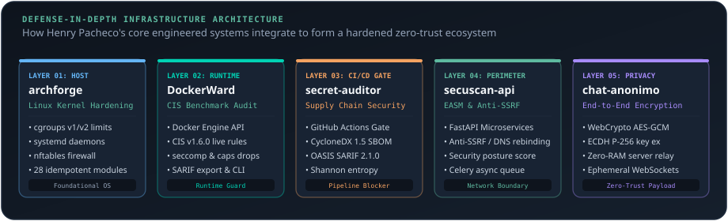
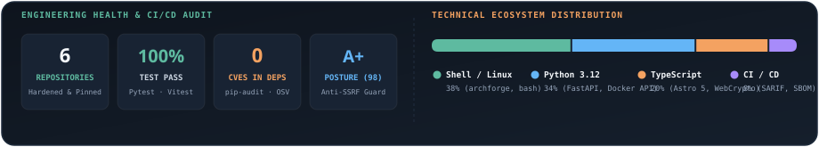

<p align="center">
  <picture>
    <source media="(prefers-color-scheme: dark)" srcset="assets/header-dark.svg">
    <source media="(prefers-color-scheme: light)" srcset="assets/header-light.svg">
    
  </picture>
</p>

<p align="center">
  <a href="https://h3n-x.netlify.app/"></a>
</p>

<p align="center">
  <a href="https://h3n-x.netlify.app/"></a>&nbsp;
  <a href="https://www.linkedin.com/in/h3n-x"></a>&nbsp;
  <a href="https://github.com/h3n-x"></a>&nbsp;
  <a href="https://github.com/h3n-x/h3n-x/blob/main/README_ES.md"></a>
</p>

<p align="center">
  <picture>
    <source media="(prefers-color-scheme: dark)" srcset="assets/divider-dark.svg">
    <source media="(prefers-color-scheme: light)" srcset="assets/divider-light.svg">
    
  </picture>
</p>

### 🌌 Engineering Philosophy

> *"Understanding systems from their kernel primitives to build resilient, hardened, and automated cloud-native pipelines."*

I operate at the convergence of **Linux systems engineering**, **runtime container security**, and **backend automation**. My work eliminates operational fragility through predictable automation, strict policy enforcement, and reproducible architectures.

* **Core Focus:** DevOps & DevSecOps Engineering, Container Runtime Security (CIS Benchmarks), Linux Kernel Hardening (`cgroups`, capabilities, `seccomp BPF`), and Automated CI/CD Quality Gates.
* **Engineering Values:** Deterministic execution, zero-CVE dependencies, fail-closed design, and formal security reporting (OASIS SARIF 2.1.0 & CycloneDX SBOM).
* **Current Status:** Open to Global Remote Roles · Junior DevOps / DevSecOps Engineer.

<p align="center">
  <picture>
    <source media="(prefers-color-scheme: dark)" srcset="assets/divider-dark.svg">
    <source media="(prefers-color-scheme: light)" srcset="assets/divider-light.svg">
    
  </picture>
</p>

### 🛡️ Defense-in-Depth Architecture

The engineered systems below interconnect into a cohesive, five-layer zero-trust ecosystem:

<p align="center">
  <picture>
    <source media="(prefers-color-scheme: dark)" srcset="assets/defense-in-depth-dark.svg">
    <source media="(prefers-color-scheme: light)" srcset="assets/defense-in-depth-light.svg">
    
  </picture>
</p>

<p align="center">
  <picture>
    <source media="(prefers-color-scheme: dark)" srcset="assets/divider-dark.svg">
    <source media="(prefers-color-scheme: light)" srcset="assets/divider-light.svg">
    
  </picture>
</p>

### 🛠️ Featured Systems & Core Repositories

<table width="100%" border="0" cellpadding="0" cellspacing="8">
  <tr>
    <td width="50%" align="center" valign="top">
      <a href="https://github.com/h3n-x/DockerWard">
        
        
      </a>
    </td>
    <td width="50%" align="center" valign="top">
      <a href="https://github.com/h3n-x/repo-secret-auditor">
        
        
      </a>
    </td>
  </tr>
  <tr>
    <td width="50%" align="center" valign="top">
      <a href="https://github.com/h3n-x/secuscan-api">
        
        
      </a>
    </td>
    <td width="50%" align="center" valign="top">
      <a href="https://github.com/h3n-x/archforge">
        
        
      </a>
    </td>
  </tr>
  <tr>
    <td width="50%" align="center" valign="top">
      <a href="https://github.com/h3n-x/portfolio">
        
        
      </a>
    </td>
    <td width="50%" align="center" valign="top">
      <a href="https://github.com/h3n-x/chat-anonimo">
        
        
      </a>
    </td>
  </tr>
</table>

<p align="center">
  <picture>
    <source media="(prefers-color-scheme: dark)" srcset="assets/divider-dark.svg">
    <source media="(prefers-color-scheme: light)" srcset="assets/divider-light.svg">
    
  </picture>
</p>

### ⚡ Technical Capabilities & Stack

```yaml
Layer 01 [Systems & Kernel Hardening]:
  OS: Arch Linux, Debian, Ubuntu LTS
  Core Primitives: systemd daemons, cgroups v1/v2, namespaces, capabilities, seccomp BPF
  Automation & Security: Idempotent Bash, nftables firewall, ShellCheck compliance

Layer 02 [Containers & Runtime Security]:
  Engines: Docker Engine API (UNIX socket), Docker Compose
  Standards: CIS Docker Benchmark v1.6.0, Non-Root Hardening, Resource Quotas
  Build Optimization: Multi-stage slim builds, zero-CVE base images, Distroless

Layer 03 [CI/CD & DevSecOps]:
  Pipelines: GitHub Actions Reusable Workflows, Pre-commit automated hooks
  Standards: OASIS SARIF 2.1.0, CycloneDX 1.5 JSON SBOM, FIRST CVSS v3.1
  Auditing: Gitleaks pattern rules, Google OSV API, pip-audit, Shannon entropy

Layer 04 [Backend & Distributed Systems]:
  Languages: Python 3.12+, TypeScript, Bash
  Frameworks: FastAPI, Pydantic v2, SQLAlchemy, Celery async queues, Redis, PostgreSQL 16
  Quality Gates: Pytest (85%+ suite coverage), Mypy strict typing, Ruff linter

Layer 05 [Cryptography & Zero-Trust Comms]:
  Standards: WebCrypto API, AES-256-GCM symmetric encryption, ECDH P-256 key exchange
  Architecture: Zero-RAM message relay, Ephemeral WebSockets, In-memory ratchets
```

<p align="center">
  <picture>
    <source media="(prefers-color-scheme: dark)" srcset="assets/divider-dark.svg">
    <source media="(prefers-color-scheme: light)" srcset="assets/divider-light.svg">
    
  </picture>
</p>

### 📡 Verified Quality Standards & Evidence

| System / Tool | Standards & Specifications | Automated Tests | CVEs in Deps | Output Format |
| :--- | :--- | :---: | :---: | :---: |
| **[DockerWard](https://github.com/h3n-x/DockerWard)** | CIS Docker Benchmark v1.6.0 | 71 Tests (100% Rules) | 0 CVEs | OASIS SARIF 2.1.0 |
| **[repo-secret-auditor](https://github.com/h3n-x/repo-secret-auditor)** | CycloneDX 1.5 SBOM · FIRST CVSS v3.1 | 74 Tests (91% Cov) | 0 CVEs | SARIF 2.1.0 + JSON |
| **[secuscan-api](https://github.com/h3n-x/secuscan-api)** | Anti-SSRF Guard · OWASP Top 10 | 86 Tests (100% Pass) | 0 CVEs | REST API / JSON |
| **[archforge](https://github.com/h3n-x/archforge)** | 28 Modules · Idempotent Bash · SemVer | Automated Sanity Suite | 0 CVEs | Native Linux Config |
| **[portfolio](https://github.com/h3n-x/portfolio)** | Astro 5 · Tailwind v4 · WCAG AA Access | E2E Playwright Suite | 0 CVEs | Static Web (Netlify) |
| **[chat-anonimo](https://github.com/h3n-x/chat-anonimo)** | WebCrypto AES-256-GCM · Zero-RAM Relay | 40 Suites (Pytest/Vitest) | 0 CVEs | Ephemeral WSS |

<p align="center">
  <picture>
    <source media="(prefers-color-scheme: dark)" srcset="assets/divider-dark.svg">
    <source media="(prefers-color-scheme: light)" srcset="assets/divider-light.svg">
    
  </picture>
</p>

### 🚀 Quick Evaluation in Terminal

To test the systems directly from your local terminal:

```bash
# 1. Audit your live Docker containers against CIS Benchmark v1.6.0
git clone https://github.com/h3n-x/DockerWard.git
cd DockerWard && pip install -e . && dockerward --help

# 2. Audit Git history for leaked credentials & generate CycloneDX SBOM
git clone https://github.com/h3n-x/repo-secret-auditor.git
cd repo-secret-auditor && pip install -e . && secret-auditor --help

# 3. Inspect 28 modular Arch Linux post-installation hardening scripts
git clone https://github.com/h3n-x/archforge.git
cd archforge && ./archforge.sh --help
```

<p align="center">
  <picture>
    <source media="(prefers-color-scheme: dark)" srcset="assets/divider-dark.svg">
    <source media="(prefers-color-scheme: light)" srcset="assets/divider-light.svg">
    
  </picture>
</p>

### 📊 Engineering Health & Ecosystem Insights

<p align="center">
  <picture>
    <source media="(prefers-color-scheme: dark)" srcset="assets/github-metrics-dark.svg">
    <source media="(prefers-color-scheme: light)" srcset="assets/github-metrics-light.svg">
    
  </picture>
</p>

<p align="center">
  <picture>
    <source media="(prefers-color-scheme: dark)" srcset="assets/divider-dark.svg">
    <source media="(prefers-color-scheme: light)" srcset="assets/divider-light.svg">
    
  </picture>
</p>

<p align="center">
  <sub>Crafted with the <b>Twilight Sky &amp; Warm Lantern</b> palette · Built for resilience, reproducibility, and precision.</sub><br>
  <sub>© 2026 Henry Pacheco (h3n-x) · <a href="https://h3n-x.netlify.app/">h3n-x.dev</a></sub>
</p>
