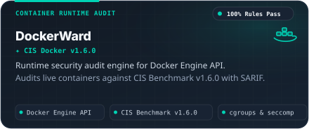
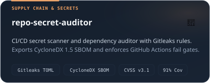
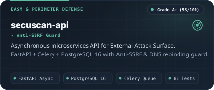
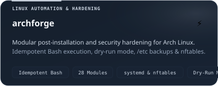
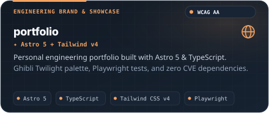
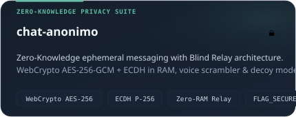

<p align="center">
  <picture>
    <source media="(prefers-color-scheme: dark)" srcset="assets/header-dark.svg">
    <source media="(prefers-color-scheme: light)" srcset="assets/header-light.svg">
    
  </picture>
</p>

<p align="center">
  <a href="https://h3n-x.netlify.app/">
    
  </a>
</p>

<p align="center">
  <a href="https://h3n-x.netlify.app/">
    
  </a>
  <a href="https://www.linkedin.com/in/h3n-x">
    
  </a>
  <a href="https://github.com/h3n-x">
    
  </a>
  <a href="https://github.com/h3n-x/h3n-x/blob/main/README.md">
    
  </a>
</p>

<p align="center">
  <picture>
    <source media="(prefers-color-scheme: dark)" srcset="assets/divider-dark.svg">
    <source media="(prefers-color-scheme: light)" srcset="assets/divider-light.svg">
    
  </picture>
</p>

### 🌌 Filosofía de Ingeniería

> *"Comprender el sistema operativo desde sus primitivas del kernel para construir pipelines cloud-native resilientes, reforzados y automatizados."*

Trabajo en la intersección entre la **administración de sistemas Linux**, la **seguridad en tiempo de ejecución de contenedores** y la **automatización backend**. Mi objetivo es erradicar la configuración manual frágil mediante automatización predecible, cumplimiento estricto de políticas de seguridad y arquitecturas reproducibles.

* **Foco Técnico:** Ingeniería DevOps & DevSecOps, Seguridad de Contenedores en Runtime (CIS Benchmarks), Endurecimiento de Linux (cgroups, capabilities, seccomp) y Quality Gates automatizados en CI/CD.
* **Valores de Ingeniería:** Ejecución determinista, cero dependencias con CVEs, diseño con cierre por fallo (*fail-closed*) y reporte formal de seguridad (OASIS SARIF 2.1.0 & CycloneDX SBOM).
* **Disponibilidad:** Abierto a roles remotos globales · DevOps / DevSecOps Engineer.

<p align="center">
  <picture>
    <source media="(prefers-color-scheme: dark)" srcset="assets/divider-dark.svg">
    <source media="(prefers-color-scheme: light)" srcset="assets/divider-light.svg">
    
  </picture>
</p>

### 🛠️ Sistemas Destacados & Repositorios Principales

<table width="100%" border="0" cellpadding="0" cellspacing="8">
  <tr>
    <td width="50%" align="center" valign="top">
      <a href="https://github.com/h3n-x/DockerWard">
        <picture>
          <source media="(prefers-color-scheme: dark)" srcset="assets/card-1-dockerward-dark.svg">
          <source media="(prefers-color-scheme: light)" srcset="assets/card-1-dockerward-light.svg">
          
        </picture>
      </a>
    </td>
    <td width="50%" align="center" valign="top">
      <a href="https://github.com/h3n-x/repo-secret-auditor">
        <picture>
          <source media="(prefers-color-scheme: dark)" srcset="assets/card-2-repo-secret-auditor-dark.svg">
          <source media="(prefers-color-scheme: light)" srcset="assets/card-2-repo-secret-auditor-light.svg">
          
        </picture>
      </a>
    </td>
  </tr>
  <tr>
    <td width="50%" align="center" valign="top">
      <a href="https://github.com/h3n-x/secuscan-api">
        <picture>
          <source media="(prefers-color-scheme: dark)" srcset="assets/card-3-secuscan-api-dark.svg">
          <source media="(prefers-color-scheme: light)" srcset="assets/card-3-secuscan-api-light.svg">
          
        </picture>
      </a>
    </td>
    <td width="50%" align="center" valign="top">
      <a href="https://github.com/h3n-x/archforge">
        <picture>
          <source media="(prefers-color-scheme: dark)" srcset="assets/card-4-archforge-dark.svg">
          <source media="(prefers-color-scheme: light)" srcset="assets/card-4-archforge-light.svg">
          
        </picture>
      </a>
    </td>
  </tr>
  <tr>
    <td width="50%" align="center" valign="top">
      <a href="https://github.com/h3n-x/portfolio">
        <picture>
          <source media="(prefers-color-scheme: dark)" srcset="assets/card-5-portfolio-dark.svg">
          <source media="(prefers-color-scheme: light)" srcset="assets/card-5-portfolio-light.svg">
          
        </picture>
      </a>
    </td>
    <td width="50%" align="center" valign="top">
      <a href="https://github.com/h3n-x/chat-anonimo">
        <picture>
          <source media="(prefers-color-scheme: dark)" srcset="assets/card-6-chat-anonimo-dark.svg">
          <source media="(prefers-color-scheme: light)" srcset="assets/card-6-chat-anonimo-light.svg">
          
        </picture>
      </a>
    </td>
  </tr>
</table>

<p align="center">
  <picture>
    <source media="(prefers-color-scheme: dark)" srcset="assets/divider-dark.svg">
    <source media="(prefers-color-scheme: light)" srcset="assets/divider-light.svg">
    
  </picture>
</p>

### ⚡ Capacidades Técnicas & Stack por Capas

```yaml
Capa 01 [Sistemas Operativos & Kernel]:
  Distribuciones: Arch Linux, Debian, Ubuntu LTS
  Núcleo: daemons systemd, cgroups v1/v2, namespaces, capabilities, seccomp BPF
  Automatización: Bash idempotente, scripts de shell, firewall nftables

Capa 02 [Contenedores & Runtime]:
  Motores: Docker Engine API, Docker Compose
  Estándares: CIS Docker Benchmark v1.6.0, Hardening no-root, cuotas de recursos
  Calidad: Multi-stage slim builds, imágenes base con 0 CVEs

Capa 03 [CI/CD & DevSecOps]:
  Pipelines: Workflows reutilizables en GitHub Actions, hooks de pre-commit
  Estándares de Seguridad: OASIS SARIF 2.1.0, CycloneDX 1.5 JSON SBOM, FIRST CVSS v3.1
  Auditoría: Reglas Gitleaks, Google OSV API, pip-audit, filtros de entropía de Shannon

Capa 04 [Backend & Programación de Sistemas]:
  Lenguajes: Python 3.12+, TypeScript, Bash
  Frameworks: FastAPI, Pydantic v2, SQLAlchemy, Asyncio
  Aseguramiento: Pytest (más del 85% de cobertura), tipado estricto con Mypy, Ruff
```

<p align="center">
  <picture>
    <source media="(prefers-color-scheme: dark)" srcset="assets/divider-dark.svg">
    <source media="(prefers-color-scheme: light)" srcset="assets/divider-light.svg">
    
  </picture>
</p>

### 📡 Evidencia Técnica Verificada & Cobertura de Pruebas

| Herramienta / Proyecto | Estándares & Certificación | Pruebas Automatizadas | Vulnerabilidades (CVEs) |
| :--- | :--- | :---: | :---: |
| **DockerWard** | CIS Docker v1.6.0 · OASIS SARIF 2.1.0 | 71 Tests (100% Reglas) | 0 CVEs |
| **repo-secret-auditor** | CycloneDX 1.5 SBOM · FIRST CVSS v3.1 | 74 Tests (91% Cobertura) | 0 CVEs |
| **secuscan-api** | OASIS SARIF 2.1.0 · Anti-SSRF Guard | 86 Tests (100% Éxito) | 0 CVEs |
| **archforge** | 28 Módulos · Bash Idempotente · SemVer | Suite de Comprobación Automatizada | 0 CVEs |
| **portfolio** | Astro 5 · Tailwind v4 · Accesibilidad WCAG AA | Pruebas E2E Playwright/CDP | 0 CVEs |
| **chat-anonimo** | WebCrypto AES-256-GCM · Relay Cero-RAM | 40 Suites (Pytest/Vitest) | 0 CVEs |

<p align="center">
  <picture>
    <source media="(prefers-color-scheme: dark)" srcset="assets/divider-dark.svg">
    <source media="(prefers-color-scheme: light)" srcset="assets/divider-light.svg">
    
  </picture>
</p>

<p align="center">
  <sub>Diseñado con la paleta <b>Twilight Sky &amp; Warm Lantern</b> (Estudio Ghibli) · Creado para resiliencia, reproducibilidad y precisión.</sub><br>
  <sub>© 2026 Henry Pacheco (h3n-x) · <a href="https://h3n-x.netlify.app/">h3n-x.netlify.app</a></sub>
</p>
